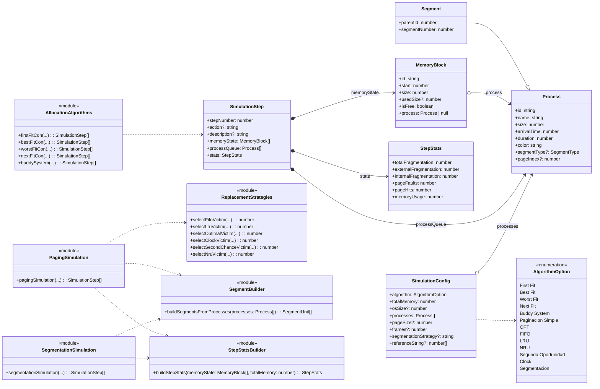
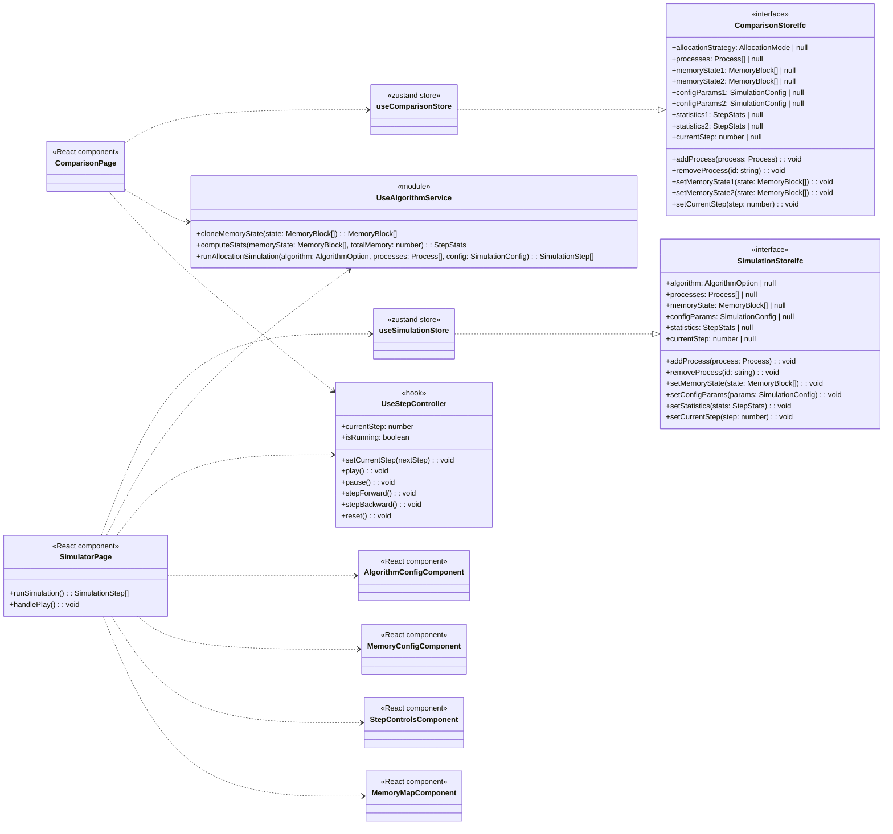

# KernelLab UML Class Diagrams

Este documento contiene 2 diagramas UML en Mermaid:

1. Dominio + Algoritmos
2. UI + Estado + Hooks

## 1) Dominio + Algoritmos

```mermaid
classDiagram
    direction LR

    class Process {
      +id: string
      +name: string
      +size: number
      +arrivalTime: number
      +duration: number
      +color: string
      +segmentType?: SegmentType
      +pageIndex?: number
    }

    class Segment {
      +parentId: number
      +segmentNumber: number
    }

    class MemoryBlock {
      +id: string
      +start: number
      +size: number
      +usedSize?: number
      +isFree: boolean
      +process: Process | null
    }

    class StepStats {
      +totalFragmentation: number
      +externalFragmentation: number
      +internalFragmentation: number
      +pageFaults: number
      +pageHits: number
      +memoryUsage: number
    }

    class SimulationStep {
      +stepNumber: number
      +action?: string
      +description?: string
      +memoryState: MemoryBlock[]
      +processQueue: Process[]
      +stats: StepStats
    }

    class SimulationConfig {
      +algorithm: AlgorithmOption
      +totalMemory: number
      +osSize?: number
      +processes: Process[]
      +pageSize?: number
      +frames?: number
      +segmentationStrategy?: string
      +referenceString?: number[]
    }

    class AlgorithmOption {
      <<enumeration>>
      First Fit
      Best Fit
      Worst Fit
      Next Fit
      Buddy System
      Paginacion Simple
      OPT
      FIFO
      LRU
      NRU
      Segunda Oportunidad
      Clock
      Segmentacion
    }

    class AllocationAlgorithms {
      <<module>>
      +firstFitCon(...): SimulationStep[]
      +bestFitCon(...): SimulationStep[]
      +worstFitCon(...): SimulationStep[]
      +nextFitCon(...): SimulationStep[]
      +buddySystem(...): SimulationStep[]
    }

    class PagingSimulation {
      <<module>>
      +pagingSimulation(...): SimulationStep[]
    }

    class SegmentationSimulation {
      <<module>>
      +segmentationSimulation(...): SimulationStep[]
    }

    class ReplacementStrategies {
      <<module>>
      +selectFifoVictim(...): number
      +selectLruVictim(...): number
      +selectOptimalVictim(...): number
      +selectClockVictim(...): number
      +selectSecondChanceVictim(...): number
      +selectNruVictim(...): number
    }

    class SegmentBuilder {
      <<module>>
      +buildSegmentsFromProcesses(processes: Process[]): SegmentUnit[]
    }

    class StepStatsBuilder {
      <<module>>
      +buildStepStats(memoryState: MemoryBlock[], totalMemory: number): StepStats
    }

    Segment --|> Process
    MemoryBlock o--> Process : process
    SimulationStep *--> MemoryBlock : memoryState
    SimulationStep *--> Process : processQueue
    SimulationStep *--> StepStats : stats
    SimulationConfig o--> Process : processes
    SimulationConfig ..> AlgorithmOption

    AllocationAlgorithms ..> SimulationStep
    PagingSimulation ..> ReplacementStrategies
    PagingSimulation ..> SegmentBuilder
    PagingSimulation ..> StepStatsBuilder
    SegmentationSimulation ..> SegmentBuilder
    SegmentationSimulation ..> StepStatsBuilder
```

## 2) UI + Estado + Hooks

```mermaid
classDiagram
    direction LR

    class SimulationStoreIfc {
      <<interface>>
      +algorithm: AlgorithmOption | null
      +processes: Process[] | null
      +memoryState: MemoryBlock[] | null
      +configParams: SimulationConfig | null
      +statistics: StepStats | null
      +currentStep: number | null
      +addProcess(process: Process): void
      +removeProcess(id: string): void
      +setMemoryState(state: MemoryBlock[]): void
      +setConfigParams(params: SimulationConfig): void
      +setStatistics(stats: StepStats): void
      +setCurrentStep(step: number): void
    }

    class ComparisonStoreIfc {
      <<interface>>
      +allocationStrategy: AllocationMode | null
      +processes: Process[] | null
      +memoryState1: MemoryBlock[] | null
      +memoryState2: MemoryBlock[] | null
      +configParams1: SimulationConfig | null
      +configParams2: SimulationConfig | null
      +statistics1: StepStats | null
      +statistics2: StepStats | null
      +currentStep: number | null
      +addProcess(process: Process): void
      +removeProcess(id: string): void
      +setMemoryState1(state: MemoryBlock[]): void
      +setMemoryState2(state: MemoryBlock[]): void
      +setCurrentStep(step: number): void
    }

    class useSimulationStore {
      <<zustand store>>
    }

    class useComparisonStore {
      <<zustand store>>
    }

    class UseAlgorithmService {
      <<module>>
      +cloneMemoryState(state: MemoryBlock[]): MemoryBlock[]
      +computeStats(memoryState: MemoryBlock[], totalMemory: number): StepStats
      +runAllocationSimulation(algorithm: AlgorithmOption, processes: Process[], config: SimulationConfig): SimulationStep[]
    }

    class UseStepController {
      <<hook>>
      +currentStep: number
      +isRunning: boolean
      +setCurrentStep(nextStep): void
      +play(): void
      +pause(): void
      +stepForward(): void
      +stepBackward(): void
      +reset(): void
    }

    class SimulatorPage {
      <<React component>>
      +runSimulation(): SimulationStep[]
      +handlePlay(): void
    }

    class ComparisonPage {
      <<React component>>
    }

    class AlgorithmConfigComponent {
      <<React component>>
    }

    class MemoryConfigComponent {
      <<React component>>
    }

    class StepControlsComponent {
      <<React component>>
    }

    class MemoryMapComponent {
      <<React component>>
    }

    useSimulationStore ..|> SimulationStoreIfc
    useComparisonStore ..|> ComparisonStoreIfc

    SimulatorPage ..> useSimulationStore
    SimulatorPage ..> UseAlgorithmService
    SimulatorPage ..> UseStepController
    SimulatorPage ..> AlgorithmConfigComponent
    SimulatorPage ..> MemoryConfigComponent
    SimulatorPage ..> StepControlsComponent
    SimulatorPage ..> MemoryMapComponent

    ComparisonPage ..> useComparisonStore
    ComparisonPage ..> UseAlgorithmService
    ComparisonPage ..> UseStepController
```
