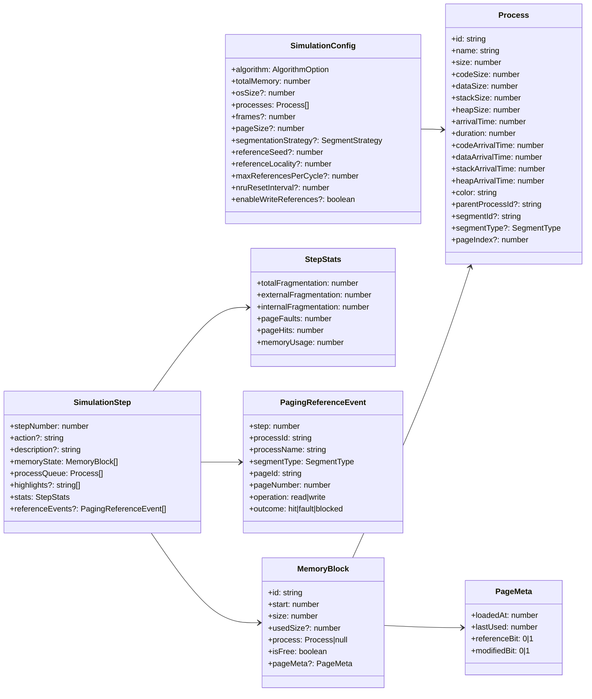

# Core Types Class Diagram

```mermaid
classDiagram
direction LR

class Process {
  +id: string
  +name: string
  +size: number
  +codeSize: number
  +dataSize: number
  +stackSize: number
  +heapSize: number
  +arrivalTime: number
  +duration: number
  +codeArrivalTime: number
  +dataArrivalTime: number
  +stackArrivalTime: number
  +heapArrivalTime: number
  +color: string
  +parentProcessId?: string
  +segmentId?: string
  +segmentType?: SegmentType
  +pageIndex?: number
}

class PageMeta {
  +loadedAt: number
  +lastUsed: number
  +referenceBit: 0|1
  +modifiedBit: 0|1
}

class MemoryBlock {
  +id: string
  +start: number
  +size: number
  +usedSize?: number
  +process: Process|null
  +isFree: boolean
  +pageMeta?: PageMeta
}

class StepStats {
  +totalFragmentation: number
  +externalFragmentation: number
  +internalFragmentation: number
  +pageFaults: number
  +pageHits: number
  +memoryUsage: number
}

class PagingReferenceEvent {
  +step: number
  +processId: string
  +processName: string
  +segmentType: SegmentType
  +pageId: string
  +pageNumber: number
  +operation: read|write
  +outcome: hit|fault|blocked
}

class SimulationStep {
  +stepNumber: number
  +action?: string
  +description?: string
  +memoryState: MemoryBlock[]
  +processQueue: Process[]
  +highlights?: string[]
  +stats: StepStats
  +referenceEvents?: PagingReferenceEvent[]
}

class SimulationConfig {
  +algorithm: AlgorithmOption
  +totalMemory: number
  +osSize?: number
  +processes: Process[]
  +frames?: number
  +pageSize?: number
  +segmentationStrategy?: SegmentStrategy
  +referenceSeed?: number
  +referenceLocality?: number
  +maxReferencesPerCycle?: number
  +nruResetInterval?: number
  +enableWriteReferences?: boolean
}

SimulationStep --> MemoryBlock
SimulationStep --> StepStats
SimulationStep --> PagingReferenceEvent
MemoryBlock --> Process
MemoryBlock --> PageMeta
SimulationConfig --> Process
```
