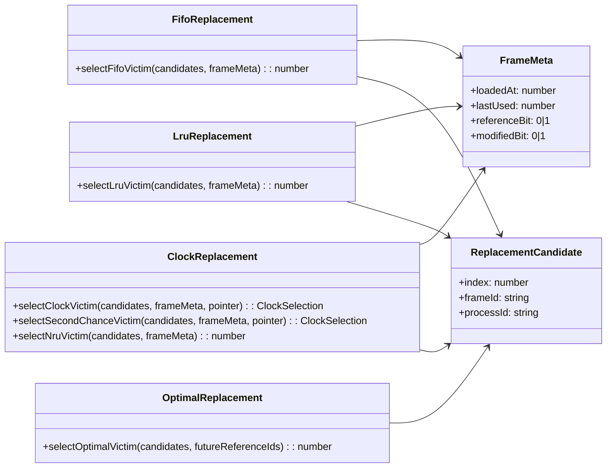

# Replacement Algorithms Class Diagram

```mermaid
classDiagram
direction LR

class FrameMeta {
  +loadedAt: number
  +lastUsed: number
  +referenceBit: 0|1
  +modifiedBit: 0|1
}

class ReplacementCandidate {
  +index: number
  +frameId: string
  +processId: string
}

class FifoReplacement {
  +selectFifoVictim(candidates, frameMeta): number
}

class LruReplacement {
  +selectLruVictim(candidates, frameMeta): number
}

class OptimalReplacement {
  +selectOptimalVictim(candidates, futureReferenceIds): number
}

class ClockReplacement {
  +selectClockVictim(candidates, frameMeta, pointer): ClockSelection
  +selectSecondChanceVictim(candidates, frameMeta, pointer): ClockSelection
  +selectNruVictim(candidates, frameMeta): number
}

FifoReplacement --> FrameMeta
FifoReplacement --> ReplacementCandidate
LruReplacement --> FrameMeta
LruReplacement --> ReplacementCandidate
OptimalReplacement --> ReplacementCandidate
ClockReplacement --> FrameMeta
ClockReplacement --> ReplacementCandidate
```
