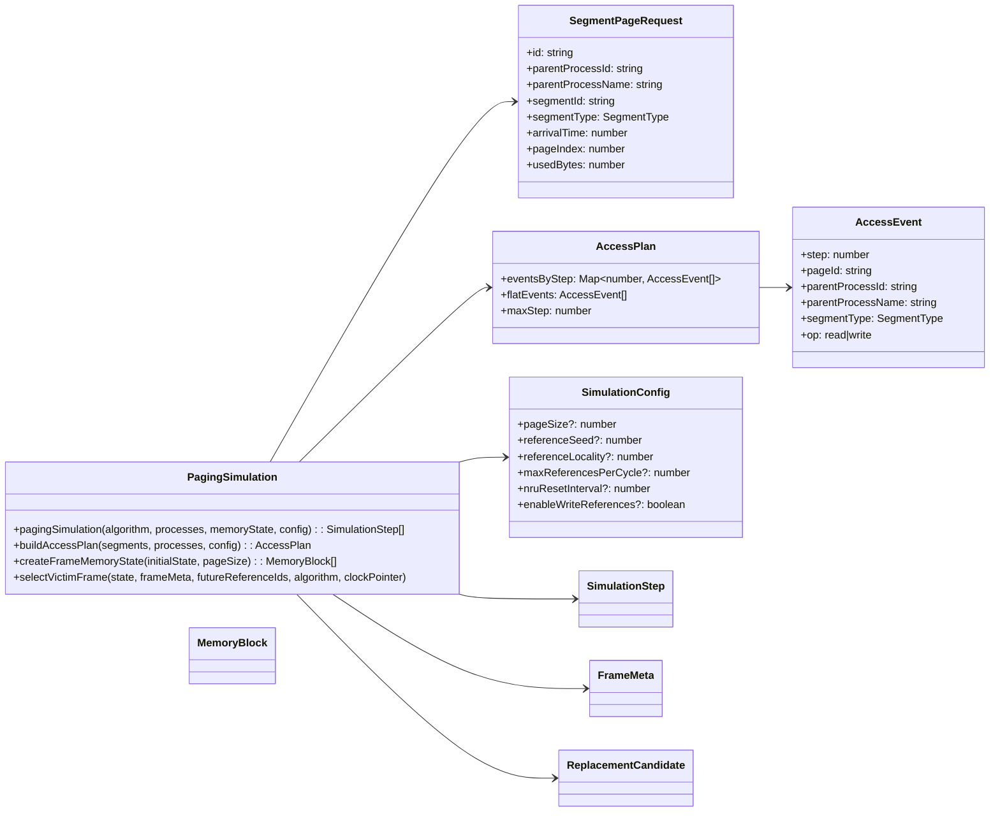

# Paging Engine Class Diagram

```mermaid
classDiagram
direction LR

class SegmentPageRequest {
  +id: string
  +parentProcessId: string
  +parentProcessName: string
  +segmentId: string
  +segmentType: SegmentType
  +arrivalTime: number
  +pageIndex: number
  +usedBytes: number
}

class AccessEvent {
  +step: number
  +pageId: string
  +parentProcessId: string
  +parentProcessName: string
  +segmentType: SegmentType
  +op: read|write
}

class AccessPlan {
  +eventsByStep: Map~number, AccessEvent[]~
  +flatEvents: AccessEvent[]
  +maxStep: number
}

class PagingSimulation {
  +pagingSimulation(algorithm, processes, memoryState, config): SimulationStep[]
  +buildAccessPlan(segments, processes, config): AccessPlan
  +createFrameMemoryState(initialState, pageSize): MemoryBlock[]
  +selectVictimFrame(state, frameMeta, futureReferenceIds, algorithm, clockPointer)
}

class SimulationConfig {
  +pageSize?: number
  +referenceSeed?: number
  +referenceLocality?: number
  +maxReferencesPerCycle?: number
  +nruResetInterval?: number
  +enableWriteReferences?: boolean
}

class SimulationStep
class MemoryBlock
class FrameMeta
class ReplacementCandidate

PagingSimulation --> SimulationConfig
PagingSimulation --> SimulationStep
PagingSimulation --> AccessPlan
AccessPlan --> AccessEvent
PagingSimulation --> FrameMeta
PagingSimulation --> ReplacementCandidate
PagingSimulation --> SegmentPageRequest
```
