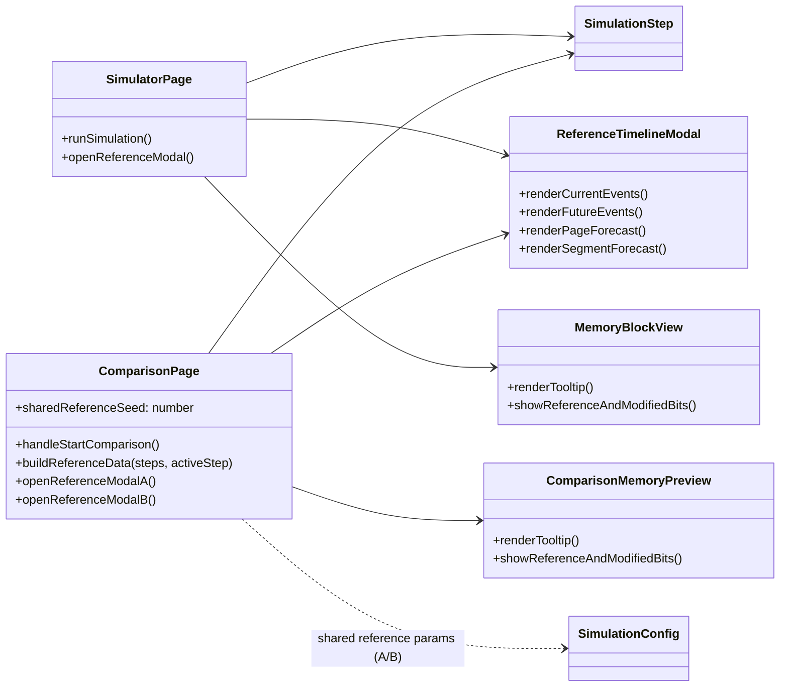

# UI Reference Visualization Class Diagram

```mermaid
classDiagram
direction LR

class SimulatorPage {
  +runSimulation()
  +openReferenceModal()
}

class ComparisonPage {
  +handleStartComparison()
  +buildReferenceData(steps, activeStep)
  +openReferenceModalA()
  +openReferenceModalB()
  +sharedReferenceSeed: number
}

class ReferenceTimelineModal {
  +renderCurrentEvents()
  +renderFutureEvents()
  +renderPageForecast()
  +renderSegmentForecast()
}

class MemoryBlockView {
  +renderTooltip()
  +showReferenceAndModifiedBits()
}

class ComparisonMemoryPreview {
  +renderTooltip()
  +showReferenceAndModifiedBits()
}

class SimulationStep
class SimulationConfig

SimulatorPage --> SimulationStep
SimulatorPage --> ReferenceTimelineModal
SimulatorPage --> MemoryBlockView

ComparisonPage --> SimulationStep
ComparisonPage --> ReferenceTimelineModal
ComparisonPage --> ComparisonMemoryPreview
ComparisonPage ..> SimulationConfig : shared reference params (A/B)
```
