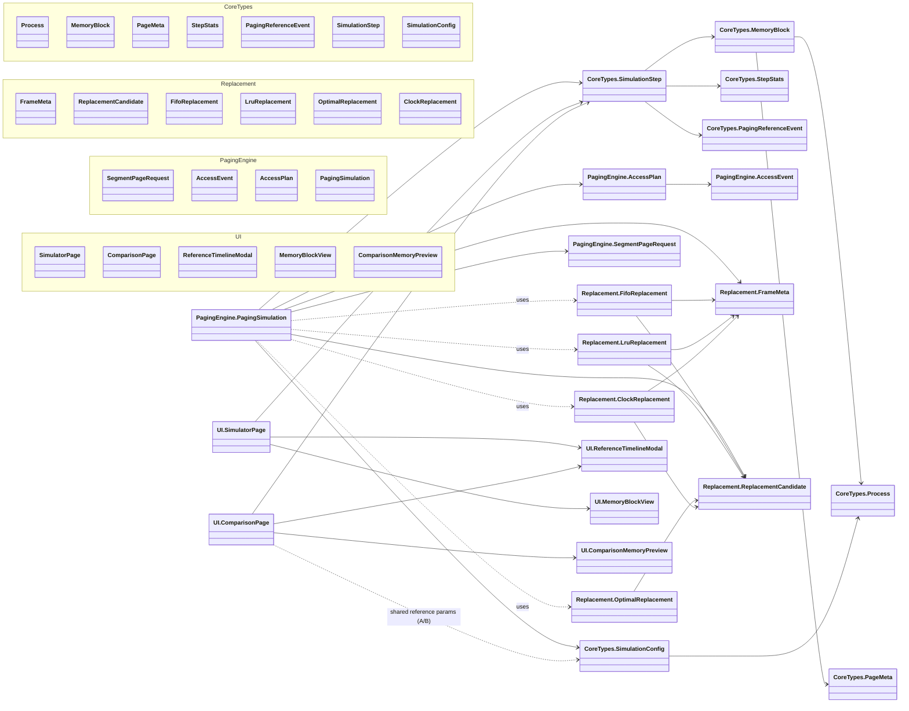

# System Integration Class Diagram

```mermaid
classDiagram
direction LR

namespace CoreTypes {
  class Process
  class MemoryBlock
  class PageMeta
  class StepStats
  class PagingReferenceEvent
  class SimulationStep
  class SimulationConfig
}

namespace Replacement {
  class FrameMeta
  class ReplacementCandidate
  class FifoReplacement
  class LruReplacement
  class OptimalReplacement
  class ClockReplacement
}

namespace PagingEngine {
  class SegmentPageRequest
  class AccessEvent
  class AccessPlan
  class PagingSimulation
}

namespace UI {
  class SimulatorPage
  class ComparisonPage
  class ReferenceTimelineModal
  class MemoryBlockView
  class ComparisonMemoryPreview
}

CoreTypes.SimulationStep --> CoreTypes.MemoryBlock
CoreTypes.SimulationStep --> CoreTypes.StepStats
CoreTypes.SimulationStep --> CoreTypes.PagingReferenceEvent
CoreTypes.MemoryBlock --> CoreTypes.Process
CoreTypes.MemoryBlock --> CoreTypes.PageMeta
CoreTypes.SimulationConfig --> CoreTypes.Process

PagingEngine.PagingSimulation --> CoreTypes.SimulationConfig
PagingEngine.PagingSimulation --> CoreTypes.SimulationStep
PagingEngine.PagingSimulation --> PagingEngine.AccessPlan
PagingEngine.AccessPlan --> PagingEngine.AccessEvent
PagingEngine.PagingSimulation --> Replacement.FrameMeta
PagingEngine.PagingSimulation --> Replacement.ReplacementCandidate
PagingEngine.PagingSimulation --> PagingEngine.SegmentPageRequest

Replacement.FifoReplacement --> Replacement.FrameMeta
Replacement.FifoReplacement --> Replacement.ReplacementCandidate
Replacement.LruReplacement --> Replacement.FrameMeta
Replacement.LruReplacement --> Replacement.ReplacementCandidate
Replacement.OptimalReplacement --> Replacement.ReplacementCandidate
Replacement.ClockReplacement --> Replacement.FrameMeta
Replacement.ClockReplacement --> Replacement.ReplacementCandidate

PagingEngine.PagingSimulation ..> Replacement.FifoReplacement : uses
PagingEngine.PagingSimulation ..> Replacement.LruReplacement : uses
PagingEngine.PagingSimulation ..> Replacement.OptimalReplacement : uses
PagingEngine.PagingSimulation ..> Replacement.ClockReplacement : uses

UI.SimulatorPage --> CoreTypes.SimulationStep
UI.SimulatorPage --> UI.ReferenceTimelineModal
UI.SimulatorPage --> UI.MemoryBlockView

UI.ComparisonPage --> CoreTypes.SimulationStep
UI.ComparisonPage --> UI.ReferenceTimelineModal
UI.ComparisonPage --> UI.ComparisonMemoryPreview
UI.ComparisonPage ..> CoreTypes.SimulationConfig : shared reference params (A/B)
```
